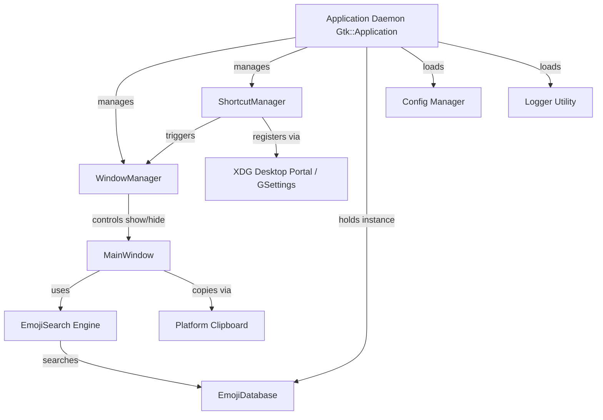

# System Architecture

Emotion Expressor is designed as a modular, high-performance native Linux application built in C++20.

## Design Philosophy

1. **Decoupled Core Logic**: The core data structures, database loader, and search engine have **zero GUI or platform dependencies**. This allows standalone testing, fast search benchmarking, and seamless integration with any frontend UI toolkit (GTK4/gtkmm, Qt, or CLI).
2. **Allocation-Conscious Performance**: Keystroke search latency is kept under 0.5 ms by precomputing lowercased searchable fields at load time and using `std::string_view` comparisons.
3. **Multi-Phase Roadmap**:
   - **Phase 1 (Completed)**: Core Data Layer & CLI Harness.
   - **Phase 2 (Completed)**: GTK4 / gtkmm UI layout, grid view, search-as-you-type, and recent emoji tracking.
   - **Phase 3 (Completed)**: Persistent background daemon (`hold()`), global keyboard shortcut manager (XDG Desktop Portal & GNOME GSettings fallback), instant toggle, and focus-loss dismissal.
   - **Phase 4**: Flatpak packaging, autostart service, and final memory/performance profiling.

## Component Overview

## Licensing & Third-Party Dependencies

- **Application Codebase**: Licensed under the **GNU General Public License v3.0 (GPL-3.0)**. See [`LICENSE`](../LICENSE) for details.
- **Emoji Dataset (`data/emojis.json`)**: Derived from Unicode CLDR / GitHub Gemoji under the **MIT License**.
- **Third-Party Libraries**:
  - `nlohmann_json`: MIT License
  - `Catch2`: Boost Software License 1.0 (BSL-1.0)
  - `gtkmm-4.0`: GNU Lesser General Public License v2.1+ (LGPL-2.1+)

