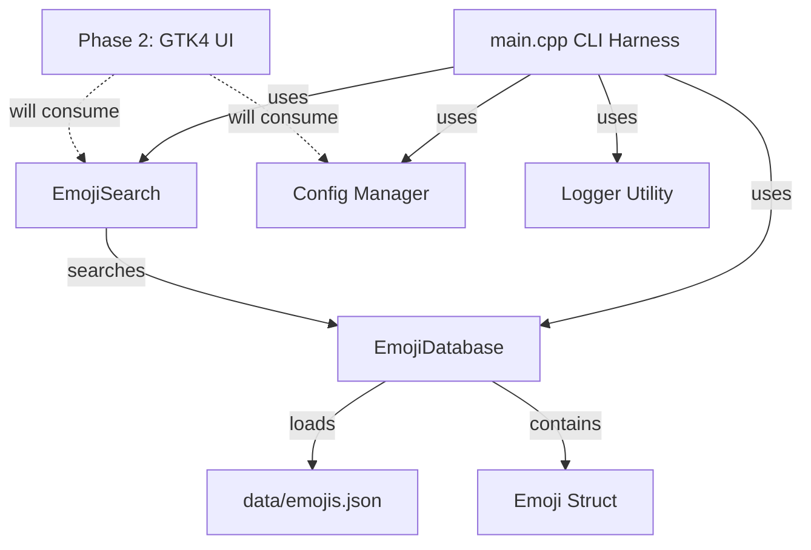

# System Architecture

Emotion Expressor is designed as a modular, high-performance native Linux application built in C++20.

## Design Philosophy

1. **Decoupled Core Logic**: The core data structures, database loader, and search engine have **zero GUI or platform dependencies**. This allows standalone testing, fast search benchmarking, and seamless integration with any frontend UI toolkit (GTK4/gtkmm, Qt, or CLI).
2. **Allocation-Conscious Performance**: Keystroke search latency is kept under 0.5 ms by precomputing lowercased searchable fields at load time and using `std::string_view` comparisons.
3. **Multi-Phase Roadmap**:
   - **Phase 1 (Completed)**: Core Data Layer & CLI Harness.
   - **Phase 2**: GTK4 / gtkmm UI layout, grid view, search-as-you-type, and recent emoji tracking.
   - **Phase 3**: Global keyboard shortcut daemon (XDG Desktop Portal / Wayland) & clipboard pasting (`wl-clipboard` / GTK Clipboard).
   - **Phase 4**: Flatpak packaging, autostart service, and final memory/performance profiling.

## Component Overview

