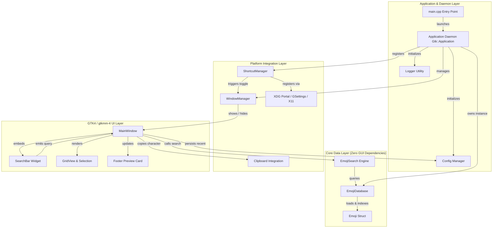

# System Architecture

Emotion Expressor is engineered as a modular, ultra-fast native Linux application built in modern C++20. It decouples high-performance core data structures from the GTK4 user interface and system-level platform integrations.

---

## 🏛️ Design Principles

1. **Decoupled Core Logic**: The core emoji data models, JSON database loader, and ranked search engine maintain **zero dependencies** on GUI libraries (GTK/GLib) or platform APIs. This guarantees fast, isolated unit testing, easy benchmarking, and frontend flexibility (e.g. GTK4, Qt, CLI).
2. **Sub-Millisecond Search Latency**: Search requests complete in `< 500 microseconds` across 1,870+ entries by precomputing lowercase string fields during database initialization and minimizing runtime heap allocations.
3. **Persistent Background Daemon**: The application runs as a lightweight single-instance background process using `Gio::Application` with `hold()`. It maintains a `0.0%` idle CPU usage while remaining ready for instant presentation.
4. **Multi-Tier Hotkey Registration**: Global keyboard shortcut management relies on a resilient fallback strategy: XDG Desktop Portal `GlobalShortcuts` $\rightarrow$ GNOME `gsettings` custom keybindings $\rightarrow$ X11 `XGrabKey`.

---

## 🧩 High-Level Architecture Diagram

```mermaid
flowchart TD
    subgraph Core ["Core Data Layer (Zero GUI Dependencies)"]
        E[Emoji Struct]
        DB[EmojiDatabase]
        Search[EmojiSearch Engine]
        DB -->|loads & indexes| E
        Search -->|queries| DB
    end

    subgraph AppLayer ["Application & Daemon Layer"]
        Main[main.cpp Entry Point]
        App[Application Daemon Gtk::Application]
        Config[Config Manager]
        Log[Logger Utility]

        Main -->|launches| App
        App -->|initializes| Config
        App -->|initializes| Log
        App -->|owns instance| DB
    end

    subgraph Platform ["Platform Integration Layer"]
        WM[WindowManager]
        SM[ShortcutManager]
        Clip[Clipboard Integration]

        App -->|manages| WM
        App -->|registers| SM
        SM -->|triggers toggle| WM
        SM -->|registers via| Portal[XDG Portal / GSettings / X11]
    end

    subgraph UI ["GTK4 / gtkmm-4 UI Layer"]
        Win[MainWindow]
        SB[SearchBar Widget]
        Grid[GridView & Selection]
        Footer[Footer Preview Card]

        WM -->|shows / hides| Win
        Win -->|embeds| SB
        Win -->|renders| Grid
        Win -->|updates| Footer
        SB -->|emits query| Win
        Win -->|calls search| Search
        Win -->|copies character| Clip
        Win -->|persists recent| Config
    end
```

---

## 🔄 Core Subsystems & Interaction

### 1. Application Lifecycle & D-Bus Single-Instance Activation
- When launched, `main.cpp` instantiates `app::Application` (a subclass of `Gtk::Application`).
- `Application` acquires a unique D-Bus application ID (`dev.emotion_expressor.EmojiPicker`).
- If another instance is already running, executing `emotion_expressor --toggle` sends a D-Bus signal to the running primary daemon. The primary instance intercepts this command via `on_command_line()` and toggles window visibility instantly without launching a duplicate process.
- Calling `hold()` during startup keeps the daemon process active in the background even when the main window is closed or hidden.

### 2. Global Shortcut Registration Workflow
- Upon daemon initialization, `ShortcutManager` attempts to bind the configured shortcut (default: `Ctrl+.`).
- It tries registering via **XDG Desktop Portal `GlobalShortcuts`** for Wayland desktop compatibility.
- If portal registration is unavailable, it automatically falls back to registering a custom shortcut in **GNOME `gsettings`** (`org.gnome.settings-daemon.plugins.media-keys`), invoking `emotion_expressor --toggle`.
- On X11 environments, it uses `XGrabKey` as a direct fallback.

### 3. Reactive UI & Search Execution Flow
1. User presses `Ctrl+.` or runs `emotion_expressor --toggle`.
2. `ShortcutManager` or D-Bus activation invokes `WindowManager::toggle()`.
3. `WindowManager::show()` presents `MainWindow`, auto-focuses `SearchBar`, and grabs keyboard focus.
4. User types a query into `SearchBar`.
5. `MainWindow` catches the search signal and passes the input string to `EmojiSearch::search()`.
6. `EmojiSearch` evaluates 1,870+ emojis against scoring tiers and returns ranked results to `MainWindow`.
7. `MainWindow` updates its `Gio::ListStore<EmojiItem>` model, automatically re-rendering the 7-column `Gtk::GridView`.
8. Selecting an emoji copies the UTF-8 character to `Clipboard`, appends the emoji to `Config`'s recent list, and hides the window.

---

## 🔐 Licensing & Dependencies

- **Application Source Code**: Licensed under the **GNU General Public License v3.0 (GPL-3.0)**.
- **Emoji Dataset (`data/emojis.json`)**: Derived from Unicode CLDR / GitHub Gemoji (MIT License).
- **Third-Party Libraries**:
  - `gtkmm-4.0` (LGPL-2.1+)
  - `nlohmann_json` (MIT)
  - `Catch2` (BSL-1.0)
