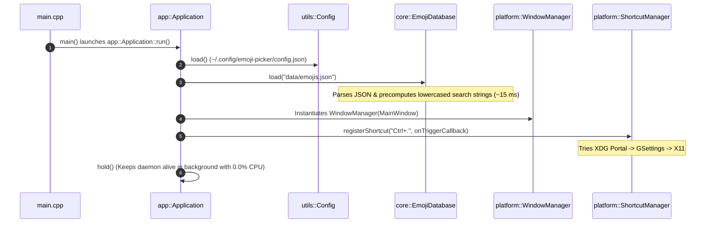
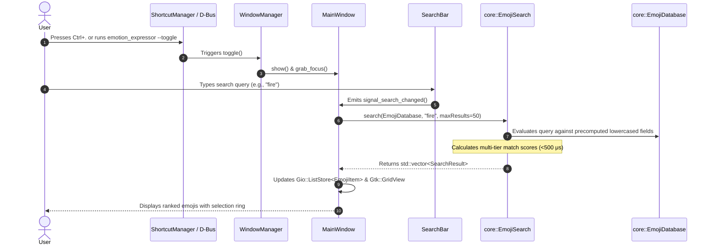
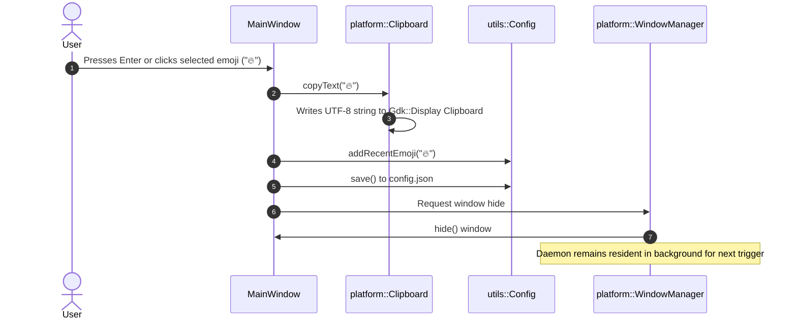

# File Reference & Data Flow Guide

This document provides a detailed breakdown of every source file in the **Emotion Expressor** codebase, identifying the main entry points, component roles, and complete step-by-step data flow across the system.

---

## 🗂️ File Index & Responsibility Matrix

### 1. Program Entry Points & Main Drivers

| File | Type | Primary Role & Responsibilities |
| :--- | :--- | :--- |
| [`src/main.cpp`](../src/main.cpp) | **Main Binary Entry** | The primary entry point for the desktop GUI daemon (`emotion_expressor`). Instantiates `app::Application`, parses CLI flags (such as `--toggle`), and runs the Gtk application loop. |
| [`src/cli_main.cpp`](../src/cli_main.cpp) | **CLI Binary Entry** | The entry point for the terminal search harness (`emoji_cli`). Loads `EmojiDatabase` directly without GTK/GUI overhead, enabling interactive terminal REPL search and single-query benchmarking. |

---

### 2. Application Daemon Core (`src/app/`)

| File | Primary Role & Responsibilities |
| :--- | :--- |
| [`src/app/Application.hpp`](../src/app/Application.hpp) / [`.cpp`](../src/app/Application.cpp) | **Main Application Daemon Class**. Inherits from `Gtk::Application`. Handles application lifecycle, D-Bus single-instance registration (`dev.emotion_expressor.EmojiPicker`), background persistence (`hold()`), loading custom CSS (`assets/styles/style.css`), database loading, and wiring `WindowManager` with `ShortcutManager`. |

---

### 3. Decoupled Core Data Engine (`src/core/`)

| File | Primary Role & Responsibilities |
| :--- | :--- |
| [`src/core/Emoji.hpp`](../src/core/Emoji.hpp) / [`.cpp`](../src/core/Emoji.cpp) | **Emoji Data Model**. Defines the `Emoji` struct containing UTF-8 characters, canonical names, Unicode names, shortcode aliases, and search keywords. Computes and stores lowercase string representations at parse time for zero-allocation runtime search comparison. Includes `fromJson()` parser. |
| [`src/core/EmojiDatabase.hpp`](../src/core/EmojiDatabase.hpp) / [`.cpp`](../src/core/EmojiDatabase.cpp) | **In-Memory Database & Indexer**. Reads `data/emojis.json` into memory. Maintains linear lists of all loaded emojis along with hash maps (`std::unordered_map`) for fast $O(1)$ lookups by alias (e.g., `:smile:`) or character (`😀`). |
| [`src/core/EmojiSearch.hpp`](../src/core/EmojiSearch.hpp) / [`.cpp`](../src/core/EmojiSearch.cpp) | **Multi-Tier Search Engine**. Implements a scored, ranked search algorithm evaluating exact matches, alias matches, keyword matches, prefix matches, and subsequence matches returning ranked `SearchResult` objects in under $500\ \mu\text{s}$. |

---

### 4. User Interface Layer (`src/ui/`)

| File | Primary Role & Responsibilities |
| :--- | :--- |
| [`src/ui/MainWindow.hpp`](../src/ui/MainWindow.hpp) / [`.cpp`](../src/ui/MainWindow.cpp) | **Main GUI Window Component**. Inherits from `Gtk::ApplicationWindow`. Houses `SearchBar`, the 7-column emoji `Gtk::GridView`, and the dynamic footer preview card. Binds data models using `Gio::ListStore<EmojiItem>`, processes 2D grid keyboard navigation (`Up/Down/Left/Right`), handles selection triggers (`Enter`), and updates recent emojis. |
| [`src/ui/SearchBar.hpp`](../src/ui/SearchBar.hpp) / [`.cpp`](../src/ui/SearchBar.cpp) | **Custom Search Input Entry**. Inherits from `Gtk::SearchEntry`. Styled dark entry widget that captures user keystrokes in real time and emits signal notifications to `MainWindow` for filtering. |

---

### 5. Platform Integration Layer (`src/platform/`)

| File | Primary Role & Responsibilities |
| :--- | :--- |
| [`src/platform/ShortcutManager.hpp`](../src/platform/ShortcutManager.hpp) / [`.cpp`](../src/platform/ShortcutManager.cpp) | **Global System Hotkey Manager**. Handles system-wide shortcut registration (`Ctrl+.`). Orchestrates backend selection using XDG Desktop Portal `GlobalShortcuts` on Wayland, GNOME `gsettings` custom keybindings, or X11 `XGrabKey`. |
| [`src/platform/WindowManager.hpp`](../src/platform/WindowManager.hpp) / [`.cpp`](../src/platform/WindowManager.cpp) | **Window Visibility & Focus Controller**. Manages window presentation (`show`), hiding (`hide`), and toggling (`toggle`). Monitors window active state properties to automatically dismiss/hide the picker on focus loss. |
| [`src/platform/Clipboard.hpp`](../src/platform/Clipboard.hpp) / [`.cpp`](../src/platform/Clipboard.cpp) | **System Clipboard Helper**. Wraps `Gdk::Display` clipboard API to copy selected UTF-8 emoji strings directly to the system clipboard across Wayland and X11 sessions. |

---

### 6. Utility Layer (`src/utils/`)

| File | Primary Role & Responsibilities |
| :--- | :--- |
| [`src/utils/Config.hpp`](../src/utils/Config.hpp) / [`.cpp`](../src/utils/Config.cpp) | **Configuration Manager**. Handles JSON serialization/deserialization to `~/.config/emoji-picker/config.json`. Manages user shortcut preferences and the persistent history of recently used emojis. |
| [`src/utils/Logger.hpp`](../src/utils/Logger.hpp) / [`.cpp`](../src/utils/Logger.cpp) | **Leveled Thread-Safe Logging System**. Provides leveled console/file logging (`DEBUG`, `INFO`, `WARN`, `ERROR`) using C++20 `std::format`. |

---

## 🌊 Complete Data Flow Architecture

The operational data flow of Emotion Expressor spans three main lifecycles: **Initialization**, **Search Execution**, and **Emoji Selection & Copying**.

### 1. Application Initialization & Startup Flow

---

### 2. Search & Real-Time Filtering Data Flow

---

### 3. Selection, Clipboard Copying & Dismissal Flow

